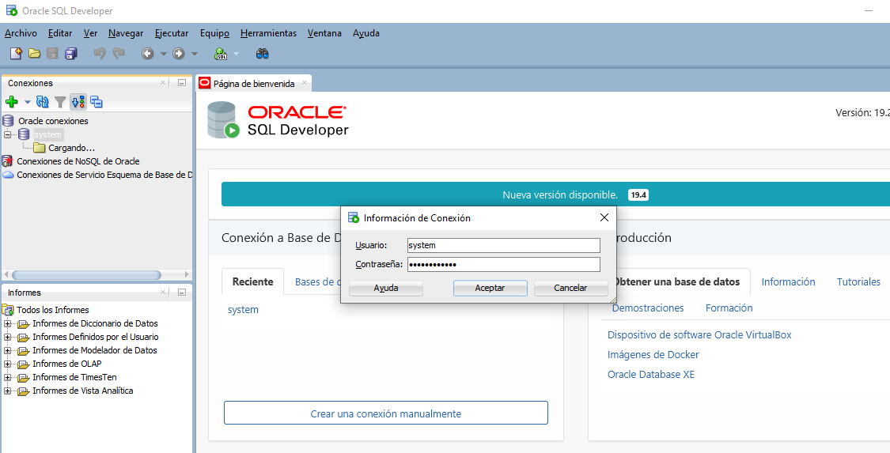
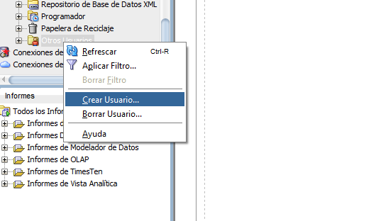
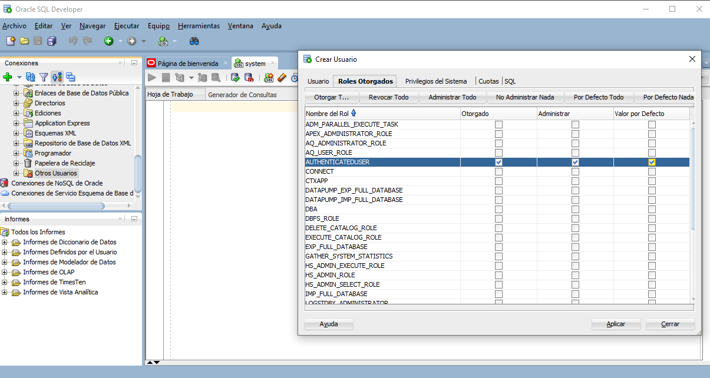
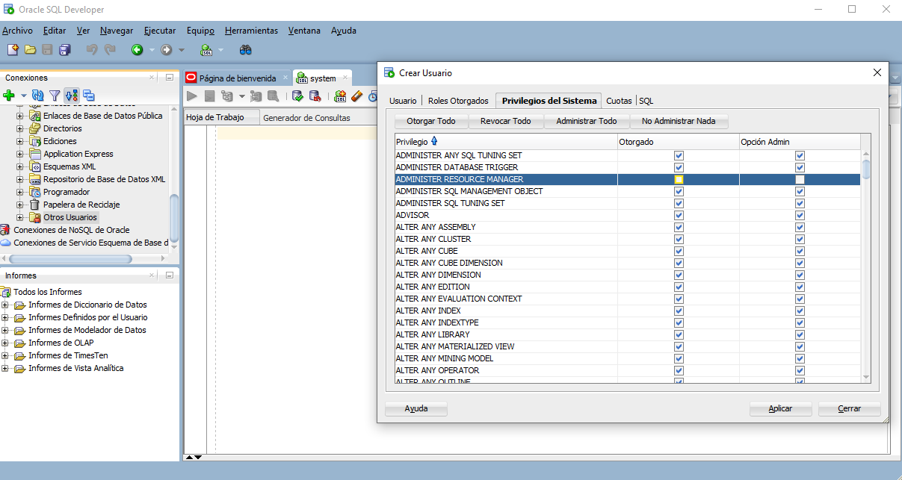
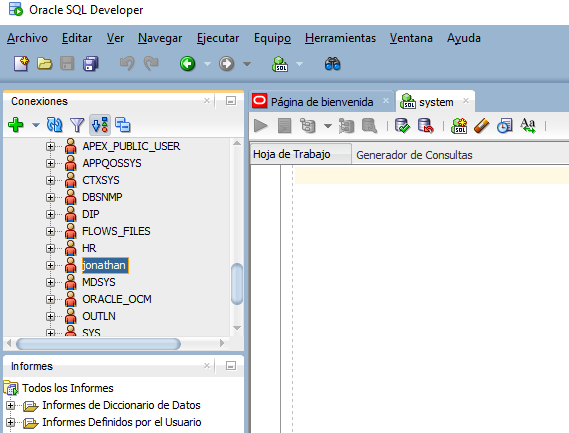
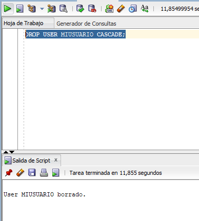

# Oracle

- [ Creación y administración de usuarios](#Creaciónyadministracióndeusuarios)
- [Importarachivos](#Importarachivos)
- [Tipos de datos](#Tiposdedatos)
- [Estructura del dataset del proyecto](#Estructuradeldatasetdelproyecto)
- [Vectores](#Vectores)
- [Matrices](#Matrices)
- [Ejercicios con matrices](#Ejerciciosconmatrices)
- [Primero calculos](#PrimerosCalculos)
- [Primero calculos](#PrimerosCalculos)
- [Primero calculos](#PrimerosCalculos)
- [Primero calculos](#PrimerosCalculos)
- [Primero calculos](#PrimerosCalculos)
- [Primero calculos](#PrimerosCalculos)
- [Primero calculos](#PrimerosCalculos)
- [Primero calculos](#PrimerosCalculos)
- [Primero calculos](#PrimerosCalculos)
- [Primero calculos](#PrimerosCalculos)
- [Primero calculos](#PrimerosCalculos)
- [Primero calculos](#PrimerosCalculos)
- [Primero calculos](#PrimerosCalculos)

## Creaciónyadministracióndeusuarios
- Pasos para crear un usuarios o esquema de usuarios de Oracle 11g con la herramienta SQL developer.
- iNiciamos sesion
- 
- Nos vamos al final y le damos en crear usuarios
- 
- En este caso solo le damos para authentificacion los permisos
- 
- En la opcion de privilegios del sistema le damos en todo
- 
- Nos vamos a la parte final y quitamos los check de sysDBA y sysOPER
- LE DAMOS APLICAR Y YA DEBEMOS TENER NUESTRO NUEVO USUARIO
- 
- OJO: PARA CREAR USUARIOS SOLO SE CREA EN MAYUSCULAS 
- CREACION CON CODIGO:
 - -- CREACION DE USUARIO
  - CREATE USER MIUSUARIO IDENTIFIED BY LACLAVE
DEFAULT TABLESPACE SYSTEM
TEMPORARY TABLESPACE TEMP
QUOTA UNLIMITED ON SYSTEM;

- --PRIVILEGIOS DE CONEXION AL USUARIO
  - GRANT CREATE SESSION TO MIUSUARIO;
- -- CREAR TABLAS DENTRO DE LA BASE
  - GRANT CREATE TABLE TO MIUSUARIO;
- -- CREAR VISTAS
  - GRANT CREATE VIEW TO MIUSUARIO;

- -- PRIVILEGIO PARA CREAR Y CONFIGURAR PROCEDIMIENTO DENTRO DE LA BASE
  - GRANT CREATE PROCEDURE TO MIUSUARIO;

- --PRIVILEGIO PARA CREAR SECUENCIAS
GRANT CREATE SEQUENCE TO MIUSUARIO;

- -- PRIVILEGIO ADMINISTRAR TABLAS
  - GRANT ALL ON NOMBRETABLE TO MIUSUARIO;
- -- ELIMINAR USUARIOS
  - DROP USER MIUSUARIO CASCADE;
  - 

